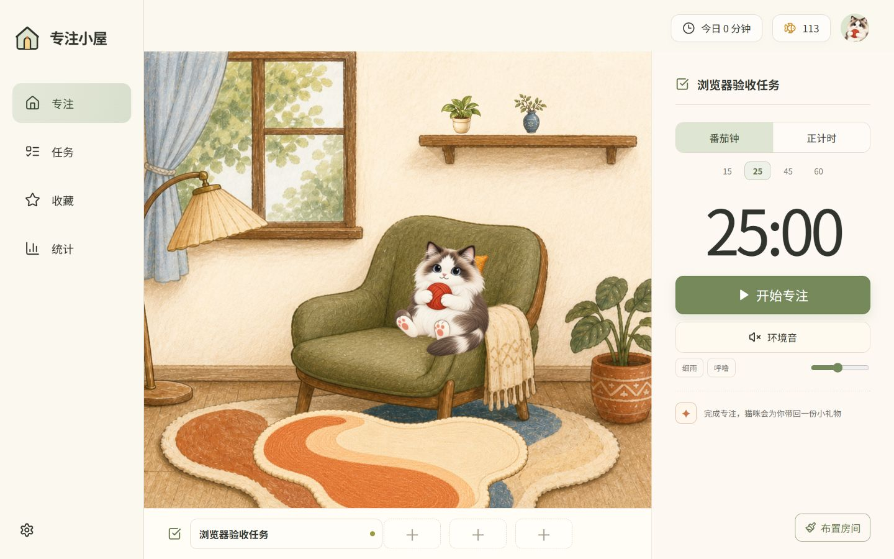

# ZYS Pomodoro｜专注小屋

一个本地优先、无需登录的原创专注 PWA。猫咪会陪你完成一次专注，并通过鱼币、礼物与房间布置构成轻量的正向反馈循环。



## 功能亮点

- **专注计时**：支持 15、25、45、60 分钟番茄钟以及正计时模式。
- **可靠恢复**：计时基于时间戳，支持暂停、继续、刷新恢复与后台标签页节流。
- **猫咪陪伴**：待机、专注、成功和放弃四种原创角色状态，并提供细微动效。
- **奖励循环**：完成专注可获得鱼币和随机礼物，重复礼物会自动兑换为鱼币。
- **任务管理**：新增、编辑、完成和删除任务，可设置截止日期并绑定当前专注任务。
- **房间布置**：使用地毯、抱枕、左摆件和右摆件四个固定槽位装饰房间。
- **数据统计**：展示今日专注时长、完成与放弃次数、近七天趋势和今日时间线。
- **本地优先**：数据保存在 IndexedDB，无账号、后端、广告、支付或远程分析。
- **离线可用**：PWA 缓存应用壳与美术资源，并对通知、Wake Lock 等能力渐进增强。

## 页面

| 路由 | 内容 |
| --- | --- |
| `/focus` | 专注计时、当前任务、环境音和奖励入口 |
| `/tasks` | 任务创建、编辑、完成、删除和专注绑定 |
| `/collection` | 收藏兑换、查看与房间布置 |
| `/stats` | 今日数据、近七天趋势与专注时间线 |

## 技术栈

- React 18 + TypeScript
- Vite 6
- React Router
- Dexie / IndexedDB
- Vitest
- Vite PWA / Service Worker
- BroadcastChannel、Notifications、Page Visibility 与 Wake Lock API

## 本地开发

建议使用 Node.js 20 或更高版本。

```bash
npm install
npm run dev
```

启动后访问 Vite 输出的本地地址，例如 `http://localhost:5173/focus`。

## 测试与构建

```bash
npm test
npm run build
npm run preview
```

生产构建输出到 `dist/`，可部署到任意支持静态站点与 SPA 回退的托管平台。

## 数据与隐私

- 所有会话、任务、收藏、设置与鱼币记录默认只保存在当前浏览器。
- 设置页面支持 JSON 数据导出、导入和全部重置。
- 多标签页通过 BroadcastChannel 保证同一时间仅运行一个专注会话。
- 完成记录、奖励和鱼币变更在同一 IndexedDB 事务中写入，避免刷新重复领奖。
- 项目不包含账号系统、后端服务、支付功能或远程分析。

## 项目结构

```text
public/assets/art/   原创房间、猫咪与收藏美术
src/components/     通用界面组件
src/data/           IndexedDB schema 与本地数据层
src/lib/            计时、奖励和统计逻辑
src/pages/          专注、任务、收藏与统计页面
src/i18n/           简体中文文案与品牌配置
artifacts/          桌面端与移动端视觉验收截图
```

## 设计说明

本项目以“专注完成后的情绪反馈”为核心体验。所有猫咪、房间、家具与收藏美术均为本项目单独制作的原创资产，不复制其他产品的名称、插画、文案或界面结构。
